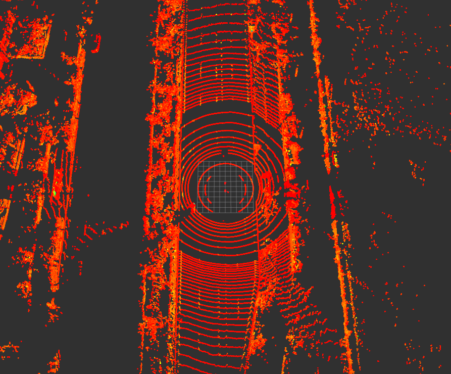

# ros_lidar_downsampling
ROS LiDAR DownSampling

## Usage
  > $ cd ~/ros_ws
  > 
  > $ catkin_make
#
## Result
* LiDAR Raw Data(PCD)

* LiDAR DownSampling Data(PCD)

* Compare before and after result (Number of Points)
* 

#
